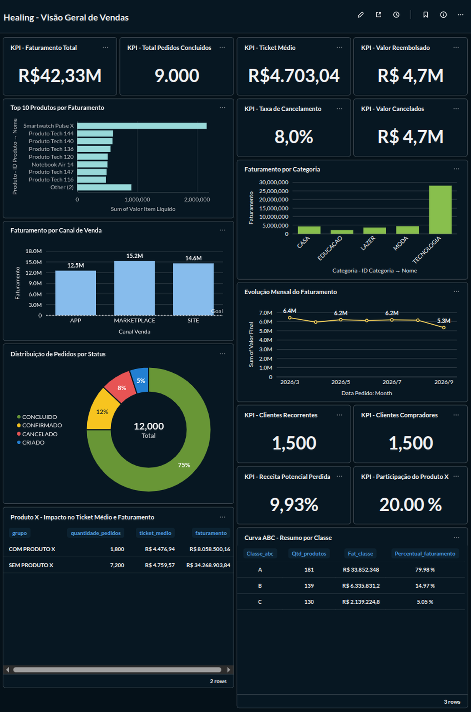
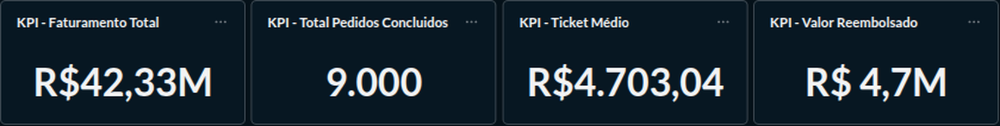
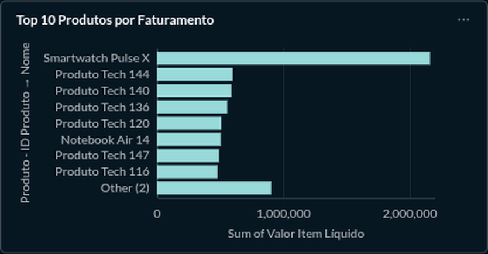
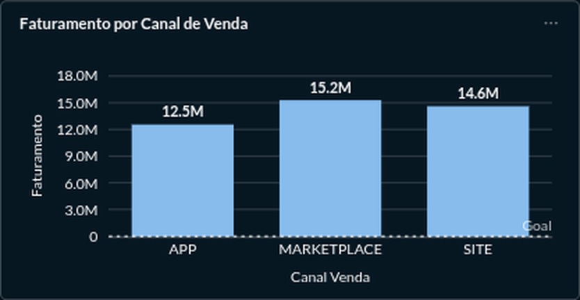
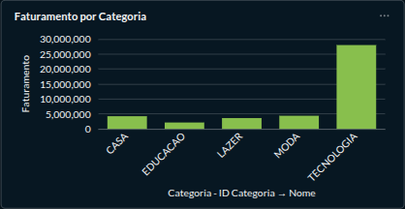
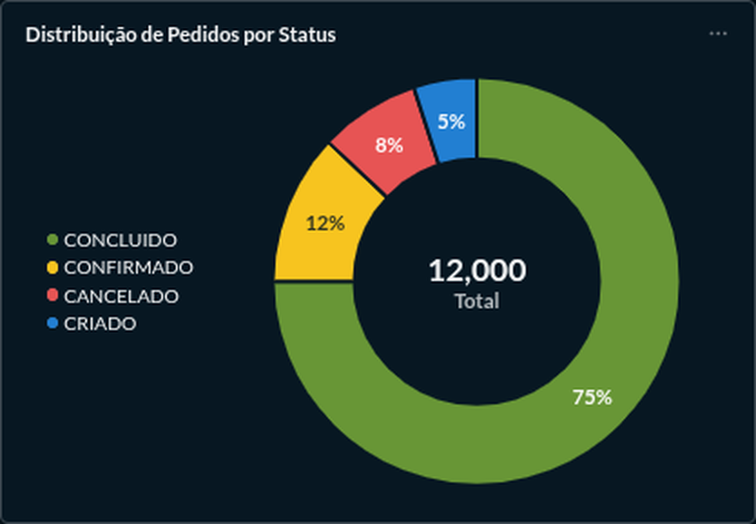
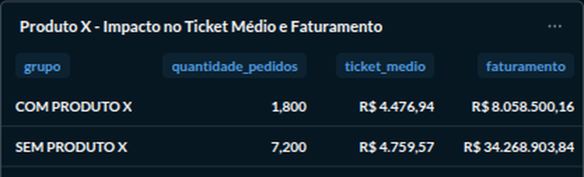
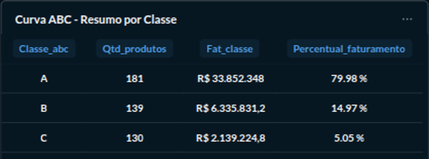

# Projeto Healing — Sales Intelligence para E-commerce

Projeto de portfólio voltado para **Dados, Banco de Dados, SQL, PostgreSQL e BI**, desenvolvido a partir de uma proposta de análise de vendas em um e-commerce fictício.

O objetivo do projeto é demonstrar uma jornada completa: definição do problema de negócio, modelagem do banco, geração de dados sintéticos, consultas SQL, construção de indicadores e criação de dashboard no Metabase.

Um dos principais focos do projeto é a investigação do **Produto X — Smartwatch Pulse X**, buscando compreender seu comportamento dentro das vendas e gerar evidências que possam apoiar decisões futuras.

---

## Problema de negócio

O cenário do Healing considera um e-commerce que possui dados de clientes, produtos, pedidos, pagamentos e itens vendidos, mas precisa transformar essas informações em respostas gerenciais.

Entre os principais problemas analisados estão:

- identificar quais produtos sustentam o faturamento;
- entender a concentração de receita;
- analisar cancelamentos e reembolsos;
- observar o comportamento dos clientes compradores;
- comparar canais de venda;
- acompanhar a evolução temporal do faturamento;
- avaliar o impacto de um produto estratégico, tratado como **Produto X**.

---

## Objetivo principal

Transformar dados transacionais em informações úteis para análise de negócio e apoio à tomada de decisão.

O projeto busca responder perguntas como:

- Quanto a empresa faturou?
- Quantos pedidos foram concluídos?
- Qual o ticket médio?
- Quais produtos geram maior faturamento?
- Quais categorias sustentam a receita?
- Quais canais vendem mais?
- Qual a taxa de cancelamento?
- Quanto valor está associado aos pedidos cancelados?
- Existe concentração de receita em poucos produtos?
- Qual a participação do Produto X nos pedidos?
- Pedidos com Produto X possuem ticket médio diferente?
- O Produto X deve receber atenção especial em decisões comerciais futuras?

---

## Tecnologias utilizadas

- **PostgreSQL** — banco de dados relacional
- **SQL** — consultas e análises
- **Metabase** — dashboard e visualização
- **Flyway** — versionamento das migrations
- **Java / Spring Boot** — camada complementar de aplicação
- **Docker** — execução local do Metabase
- **Git / GitHub** — versionamento e documentação
- **Neon** — PostgreSQL em nuvem utilizado durante testes de migração e publicação

---

## Arquitetura do projeto

```text
Dados transacionais
        ↓
PostgreSQL
        ↓
SQL
        ↓
Metabase
        ↓
Dashboard
        ↓
Insights
        ↓
Apoio à decisão
```

Durante a evolução do projeto, o PostgreSQL também foi migrado para o Neon para validar uma arquitetura com banco em nuvem e Metabase desacoplado do ambiente local.

---

## Modelo de dados

As principais entidades do projeto são:

```text
Cliente
   │
   └── Pedido
          │
          ├── ItemPedido ─── Produto ─── Categoria
          │
          └── Pagamento
                 │
                 └── TentativaPagamento
```

Principais relacionamentos:

- Cliente **1:N** Pedido
- Pedido **1:N** ItemPedido
- Produto **1:N** ItemPedido
- Categoria **1:N** Produto
- Pedido **1:N** Pagamento
- Pagamento **1:N** TentativaPagamento

A entidade `ItemPedido` é especialmente importante para análises de produto, pois registra quantidade, preço unitário e desconto aplicado.

---

## Base de dados sintética

A base atual foi criada para fins de estudo e portfólio.

Ela contém aproximadamente:

- **2.000 clientes**
- **500 produtos**
- **12.000 pedidos**
- milhares de itens de pedido
- registros de pagamentos
- registros de tentativas de pagamento

Os dados são **sintéticos**. Portanto, os resultados devem ser interpretados como evidências da base criada para estudo, e não como comportamento representativo de um e-commerce real.

---

# Dashboard no Metabase

O projeto possui um dashboard analítico desenvolvido no Metabase com foco em vendas, comportamento dos pedidos, produtos e clientes.

## Visão geral



## KPIs principais



## Top 10 produtos por faturamento



## Faturamento por canal de venda



## Faturamento por categoria



## Evolução mensal do faturamento


## Distribuição de pedidos por status



## Produto X — impacto no negócio



## Curva ABC



---

# Principais indicadores

A versão atual do dashboard apresenta aproximadamente:

- **Faturamento total:** R$ 42,33 milhões
- **Pedidos concluídos:** 9.000
- **Ticket médio:** R$ 4.703,04
- **Taxa de cancelamento:** 8,0%
- **Valor associado a pedidos cancelados:** aproximadamente R$ 4,7 milhões
- **Receita potencial perdida:** aproximadamente 9,93%
- **Clientes compradores:** 1.500
- **Clientes recorrentes:** 1.500

A recorrência de 100% observada nesta base é tratada como uma característica da geração sintética dos dados, e não como comportamento esperado de clientes reais.

---

# Análise do Produto X

Um dos principais objetivos do Healing foi investigar o comportamento do **Produto X**, representado pelo **Smartwatch Pulse X**.

A motivação dessa análise foi entender se o produto possui importância suficiente para justificar acompanhamento específico e se sua presença altera o comportamento econômico dos pedidos.

A hipótese analisada foi:

> **Pedidos que contêm o Produto X apresentam comportamento de ticket médio e receita diferente dos pedidos sem o Produto X.**

## Participação nos pedidos

Entre os pedidos concluídos:

- **1.800 pedidos** continham o Produto X;
- **7.200 pedidos** não continham o Produto X.

Portanto, o Produto X esteve presente em aproximadamente:

**20,00% dos pedidos concluídos**

## Comparação do ticket médio

### Pedidos com Produto X

- Quantidade de pedidos: **1.800**
- Ticket médio: **R$ 4.476,94**
- Faturamento dos pedidos: **R$ 8.058.500,16**

### Pedidos sem Produto X

- Quantidade de pedidos: **7.200**
- Ticket médio: **R$ 4.759,57**
- Faturamento dos pedidos: **R$ 34.268.903,84**

## Resultado

O ticket médio dos pedidos com Produto X foi aproximadamente:

**R$ 282,63 menor**

que o ticket médio dos pedidos sem o produto.

A diferença é de aproximadamente **5,9%**.

Esse resultado mostra que o Produto X pode ser relevante individualmente em faturamento e participação nos pedidos, mas isso não significa necessariamente que ele aumente o valor médio da cesta.

Essa distinção é importante porque evita decisões baseadas apenas no ranking de vendas do produto.

---

# Como a análise do Produto X pode apoiar decisões futuras

O objetivo da análise não é decidir automaticamente se o Produto X deve ser mantido, removido, promovido ou receber desconto.

O objetivo é criar uma base de evidências para apoiar decisões futuras.

Com dados reais e acompanhamento contínuo, essa análise poderia apoiar decisões relacionadas a:

- permanência no catálogo;
- reposicionamento comercial;
- campanhas;
- precificação;
- descontos;
- cross-sell;
- análise de margem;
- produtos comprados em conjunto;
- sazonalidade;
- recorrência;
- desempenho por canal de venda;
- comportamento da cesta.

Indicadores que poderiam ser acompanhados futuramente:

- ticket médio com e sem Produto X;
- participação do Produto X nos pedidos;
- participação do Produto X na receita;
- margem dos pedidos com Produto X;
- quantidade média de itens por pedido;
- produtos mais comprados junto com o Produto X;
- frequência de recompra;
- evolução mensal das vendas;
- impacto de descontos;
- desempenho antes e depois de campanhas.

A proposta do projeto é permitir que essas decisões sejam tomadas com base em dados e não apenas em percepção comercial.

---

# Curva ABC

A Curva ABC foi aplicada sobre o faturamento dos produtos com vendas concluídas.

| Classe | Quantidade de produtos | Faturamento aproximado | Participação |
|---|---:|---:|---:|
| A | 181 | R$ 33,85 milhões | 79,98% |
| B | 139 | R$ 6,34 milhões | 14,97% |
| C | 130 | R$ 2,14 milhões | 5,05% |

A análise mostrou que:

> **181 dos 450 produtos com vendas concluídas concentram aproximadamente 80% do faturamento.**

Esse resultado permite visualizar a concentração da receita e pode apoiar priorização de produtos, acompanhamento comercial e análise de catálogo.

---

# Como executar o Metabase localmente

O dashboard foi desenvolvido e validado localmente com o Metabase em Docker.

## Pré-requisitos

- Docker instalado
- acesso ao banco PostgreSQL
- container do Metabase criado previamente

## Iniciar o Metabase

```bash
docker start metabase
```

## Verificar se está em execução

```bash
docker ps
```

## Acessar no navegador

```text
http://localhost:3000
```

## Consultar logs

```bash
docker logs -f metabase
```

## Parar o Metabase

```bash
docker stop metabase
```

Essa abordagem permite demonstrar o dashboard localmente em entrevistas e apresentações técnicas.

---

# Execução usando banco no Neon

Durante a evolução do projeto, o banco de dados do Healing também foi migrado para o Neon.

A estrutura utilizada nos testes foi:

```text
Neon
├── neondb
│   └── dados do Projeto Healing
│
└── metabase
    └── configurações internas do Metabase
        ├── dashboards
        ├── perguntas
        ├── coleções
        └── configurações
```

A conexão do banco Healing no Metabase utiliza PostgreSQL com SSL.

Exemplo de configuração:

```text
Host: <host do Neon>
Port: 5432
Database: neondb
User: <usuário>
SSL: require
```

Credenciais e senhas não são armazenadas neste repositório.

---

# Tentativa de publicação pública

Também foi realizada uma tentativa de publicação do Metabase em serviço gratuito.

O principal limitador encontrado foi a quantidade de memória disponível no plano gratuito utilizado.

Por esse motivo, a versão atual do projeto mantém o dashboard executado localmente.

A publicação pública permanece como evolução futura do projeto.

---

# Estrutura sugerida do repositório

```text
projeto-Healing/
│
├── README.md
├── docs/
│   ├── img/
│   │   ├── dashboard-visao-geral.png
│   │   ├── dashboard-kpis-principais.png
│   │   ├── dashboard-top10-produtos.png
│   │   ├── dashboard-canal-venda.png
│   │   ├── dashboard-categoria.png
│   │   ├── dashboard-evolucao-mensal.png
│   │   ├── dashboard-status-pedidos.png
│   │   ├── dashboard-produto-x.png
│   │   ├── dashboard-curva-abc.png
│   │   └── modelo-dados-healing.png
│   └── decisoes-arquitetura.md
├── sql/
│   ├── analises/
│   │   ├── faturamento.sql
│   │   ├── produto-x.sql
│   │   └── curva-abc.sql
│   └── validacoes/
├── src/
│   └── ...
├── powerbi/
├── python/
└── pom.xml
```

---

# Limitações

O projeto possui algumas limitações importantes:

- os dados são sintéticos;
- não existe causalidade comprovada nas análises;
- algumas distribuições refletem regras da geração de dados;
- a recorrência de clientes está artificialmente elevada;
- não existem todas as variáveis necessárias para análise completa de margem, conversão, aquisição e navegação;
- o dashboard ainda não está publicado de forma permanente na internet.

Essas limitações são documentadas para evitar interpretações inadequadas.

---

# Próximos passos

Possíveis evoluções para uma versão futura:

- publicação pública do Metabase;
- RFM;
- retenção;
- análise de coortes;
- análise de recompra;
- market basket analysis;
- análise de margem;
- análise de descontos;
- acompanhamento temporal do Produto X;
- Python e Pandas;
- Power BI;
- automação de indicadores;
- novas análises de clientes e produtos.

---

# Conclusão

O Healing foi desenvolvido para demonstrar uma jornada completa de análise de dados:

```text
Problema de negócio
        ↓
Modelagem
        ↓
Banco de dados
        ↓
Integridade e versionamento
        ↓
SQL
        ↓
Análise
        ↓
Dashboard
        ↓
Interpretação
        ↓
Apoio à decisão
```

O principal aprendizado do projeto está em diferenciar **observar um número** de **interpretar corretamente o que ele representa**.

O Produto X apareceu como um item relevante dentro da base, mas sua presença nos pedidos não foi associada a aumento do ticket médio.

Esse resultado reforça a importância de analisar dados antes de tomar decisões comerciais.

A proposta do Healing é justamente criar uma base analítica que permita acompanhar produtos, vendas, clientes e indicadores ao longo do tempo e apoiar decisões futuras com evidências.

---

## Autor

Projeto desenvolvido como parte de uma jornada de formação e portfólio em:

**Dados | Banco de Dados | SQL | PostgreSQL | BI | Java | Spring Boot**
